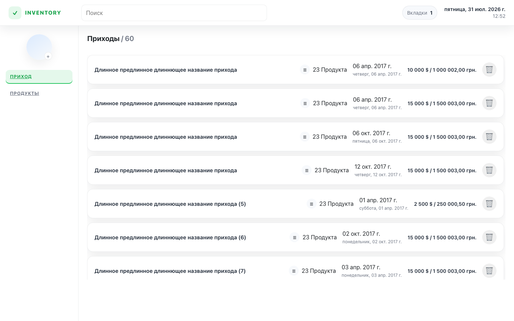
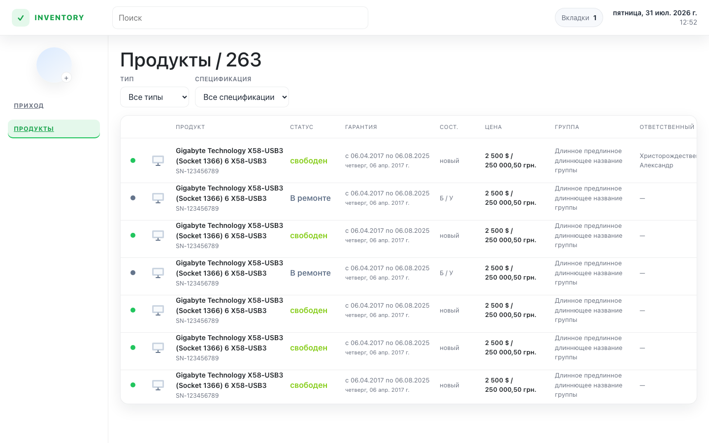
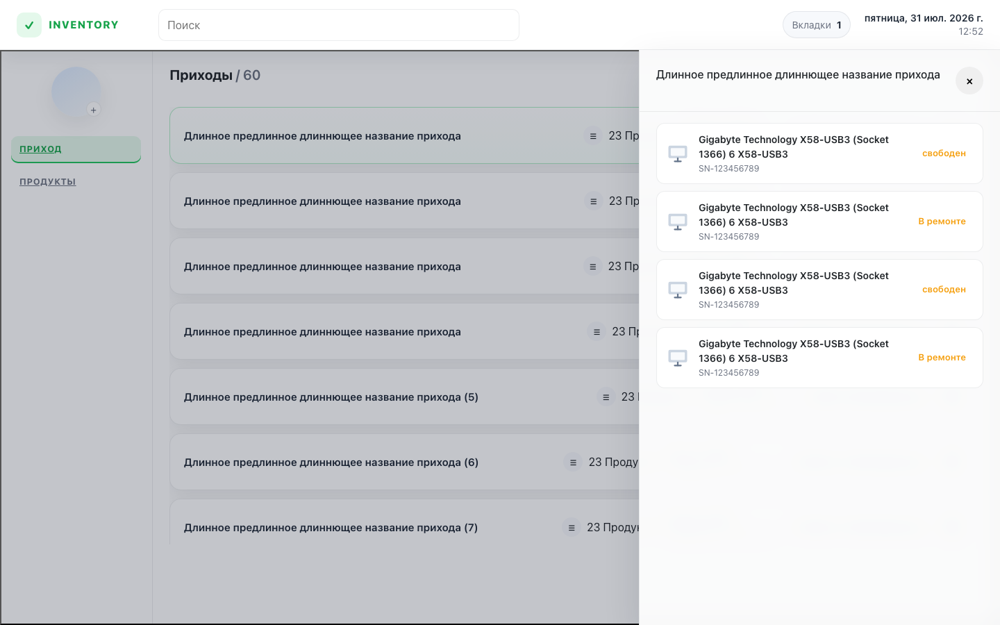
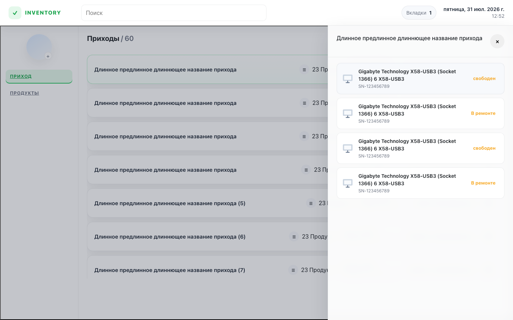

# Inventory CRM

Тестовое задание: учёт приходов и продуктов на складе.

**Сайт:** https://tt.tex-home.cc  
**Репозиторий:** https://github.com/myrron08/inventory-crm

Подробнее как собирал и деплоил — в [DEVLOG.md](./DEVLOG.md).

## Скриншоты (с живого демо)

### Приходы



### Продукты



### Панель прихода



### Удаление



## Запуск у себя

```bash
npm install
cp .env.example .env
npm run dev
```

Клиент: http://localhost:5173  
API: http://localhost:3001/api

Через Docker:

```bash
docker compose up --build
```

## Что внутри

- React + Redux на фронте, Express + Socket.io на бэке
- REST для UI, GraphQL как второй API
- данные в памяти (seed), SQL-схема в `database/`
- тесты: `npm run test` (23 штуки)

## Автор

[@myrron08](https://github.com/myrron08)
