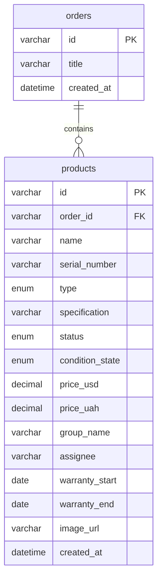

# ER Diagram — Inventory CRM

Relational model for MySQL 8+. Matches `schema.sql` and optional `db.mwb`.

## Mermaid

## Cardinality

| Relationship          | Type | On delete |
| --------------------- | ---- | --------- |
| `orders` → `products` | 1:N  | CASCADE   |

## Runtime note

The demo API uses an in-memory store seeded from `apps/server/src/data/seed.ts`. The SQL model documents the production database shape for Workbench and future MySQL integration.

## Workbench model

Open or regenerate `database/db.mwb` in MySQL Workbench from this schema — see [README.md](./README.md).
